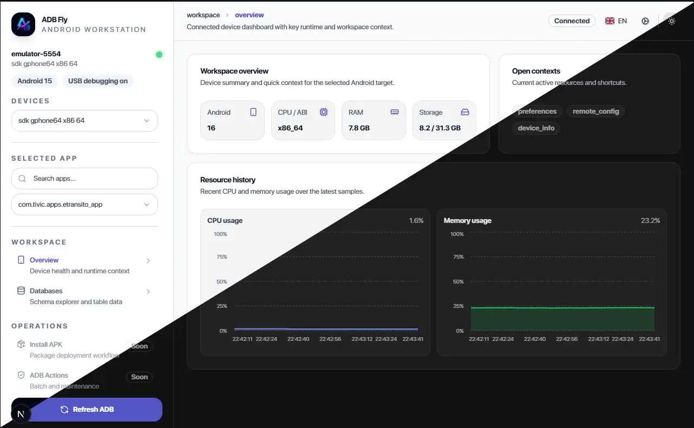

# ADB Fly

<div align="center">

[](https://github.com/edgardhsl/adbfly)
[](https://github.com/edgardhsl/adbfly/blob/main/LICENSE)




**Navegue e gerencie bancos de dados SQLite em dispositivos Android via ADB**

[English](./README.md) · [Português](./README.pt-BR.md) · [Español](./README.es.md)

</div>

---

## Sobre

ADB Fly é um aplicativo desktop que permite navegar e gerenciar bancos de dados SQLite de apps instalados em dispositivos Android conectados via ADB (Android Debug Bridge).

---

## Recursos

- **Navegador de Dispositivos**: Liste e selecione dispositivos Android conectados via ADB
- **Explorador de Apps**: Veja apps instalados no dispositivo selecionado
- **Navegador de Bancos**:
  - Liste bancos de dados SQLite de cada app
  - Visualize tabelas com paginação, ordenação e filtragem
  - Edição inline de células
  - Adição e exclusão de linhas
  - Sincronização automática das alterações para o dispositivo
- **Busca Global na Sidebar**: Busque por dispositivos, apps, bancos e tabelas
- **Multi-idioma**: Português, Inglês e Espanhol

---

## Requisitos

### Software
- [ADB](https://developer.android.com/studio/command-line/adb) (Android SDK Platform Tools)
- OpenSSL (somente para build local com SQLCipher)
- Windows 10/11 (outras plataformas não testadas)

### Dispositivo Android
- Android 5.0+ (Lollipop)
- Depuração USB ativada nas Opções do Desenvolvedor

### Configurar Dispositivo Android
1. Vá em **Configurações > Sobre o Phone**
2. Toque em **Número da Build** 7 vezes para ativar Opções do Desenvolvedor
3. Vá em **Configurações > Opções do Desenvolvedor**
4. Ative **Depuração USB**
5. Conecte o dispositivo via USB
6. Aceite o prompt de autorização no dispositivo

---

## Instalação

```bash
# Instalar dependências
npm install

# Executar em modo desenvolvimento
npm run dev
npm run tauri:dev

# Build para produção
npm run build
npm run tauri:build
```

O executável estará em `src-tauri/target/release/`

### SQLCipher com OpenSSL (crate Rust)

O projeto usa o crate `openssl` sem build vendorizado do OpenSSL.

Para rodar:

```powershell
npm run tauri:dev
```

Se OpenSSL estiver configurado (`OPENSSL_DIR` ou `OPENSSL_LIB_DIR` + `OPENSSL_INCLUDE_DIR`), o SQLCipher é habilitado.
Se não estiver, o app inicia com fallback SQLite.

---

## Uso

1. Conecte seu dispositivo Android via USB
2. Certifique-se de que a depuração USB está ativada
3. Selecione seu dispositivo na barra lateral
4. Expanda o dispositivo para ver os apps instalados
5. Selecione um app para ver seus bancos de dados
6. Clique em um banco de dados, depois selecione uma tabela
7. Clique duas vezes em uma célula para editar, pressione Enter para salvar

---

## Stack Tecnológica

| Camada | Tecnologia |
|--------|------------|
| Frontend | Next.js 16, React 19, Tailwind CSS |
| Desktop | Tauri 2 |
| Backend | Rust |
| Banco de dados | rusqlite |
| Comunicação | ADB |

---

## Contribuindo

Contribuições são bem-vindas! Leia [CONTRIBUTING.md](CONTRIBUTING.md) antes de enviar PRs.

---

## Licença

Licença MIT - veja o arquivo [LICENSE](LICENSE).

---

## FAQ

### Não consigo ver meu dispositivo?
Certifique-se de que:
- A depuração USB está ativada
- O dispositivo está autorizado (verifique o prompt no dispositivo)
- Execute `adb devices` para verificar a conexão

### O banco de dados não abre?
Alguns apps podem ter bancos de dados corrompidos ou acesso restrito. Tente fechar o app no seu dispositivo primeiro.

### Posso editar qualquer tabela?
Apenas tabelas com chave primária podem ser editadas. O app usa a chave primária para identificar linhas.

### As alterações são salvas no dispositivo?
Sim! Após INSERT, UPDATE ou DELETE, o banco de dados modificado é automaticamente enviado de volta ao dispositivo.

---

<div align="center">

**Feito com ❤️ por [EdgarHS](https://github.com/edgardhsl)**

</div>
